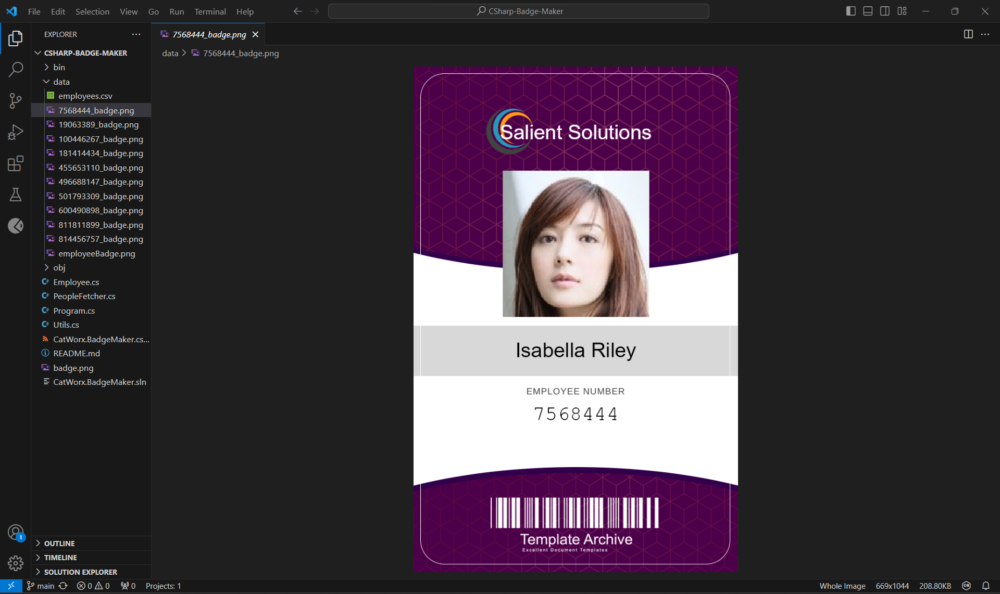

# CSharp-Badge-Maker | Salient Solutions

## Description

A C# application that generates employee badges with employee name and ID number.

  ## Table of Contents

  - [Installation](#installation)
  - [User Story](#user-story)
  - [Questions](#questions)
  - [Screenshot](#screenshot)

  ## Installation

  - C# extension for CS Code
  - .Net CORE SDK
  - SkiaSharp
  - NewtonSoft.Json
  - Place Kitten
  - Random User Generator API

  ## User Story

  - Objective:
    As a user, I want to develop create employee badges that render the company name, employee first and last name, and employee ID number.

  - Acceptance Criteria:
    This is done when the application performs as expected on Windows devices (See screenshot). 

  ## Questions

  - Please email questions to joseph.s.foster@icloud.com.

  - For additional works, please visit https://github.com/joseph-s-foster.

  ## Screenshot

  
